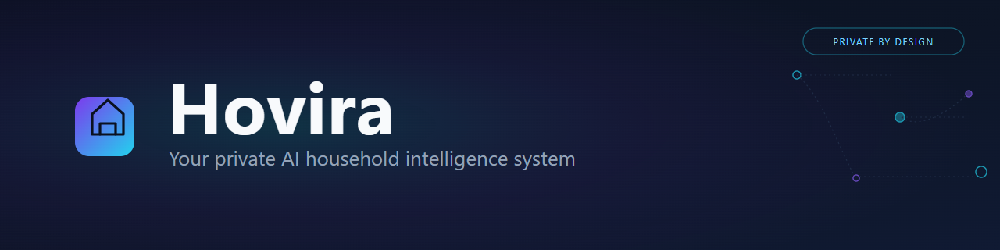
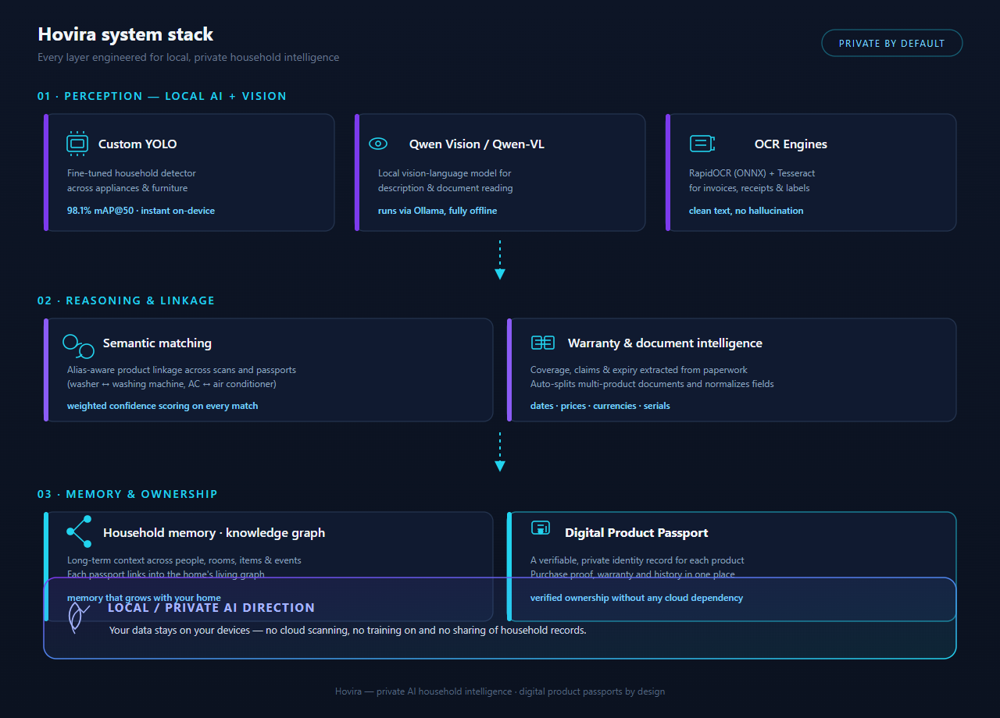
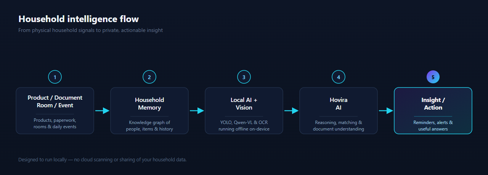
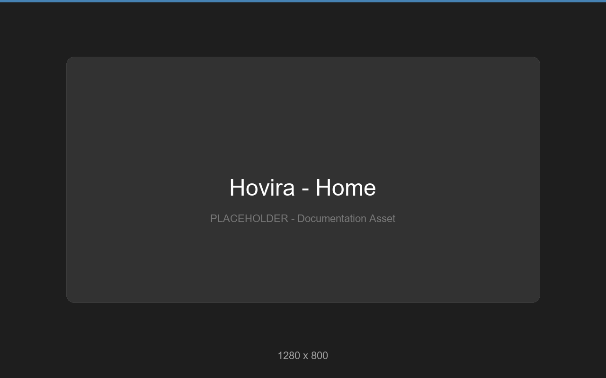
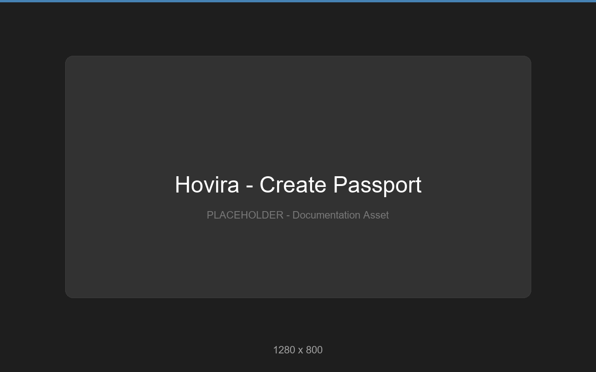
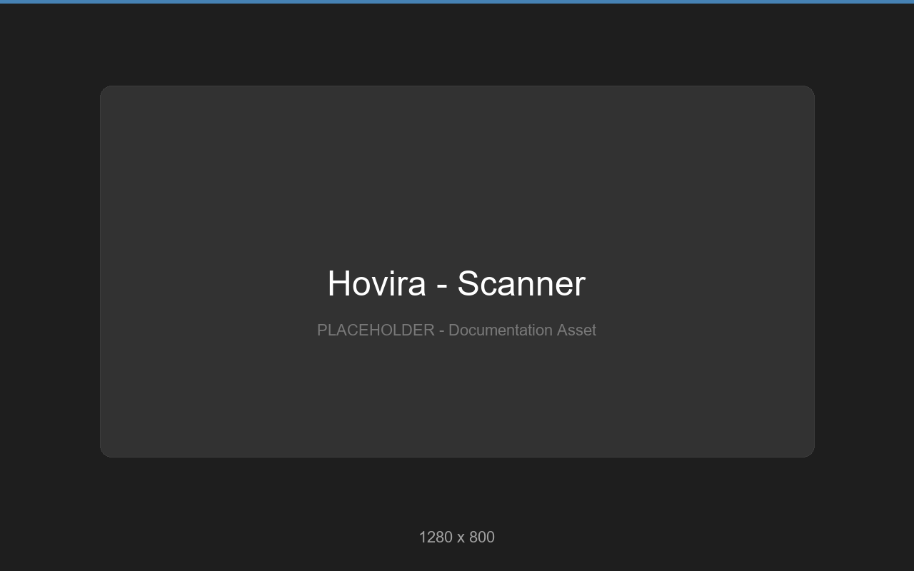
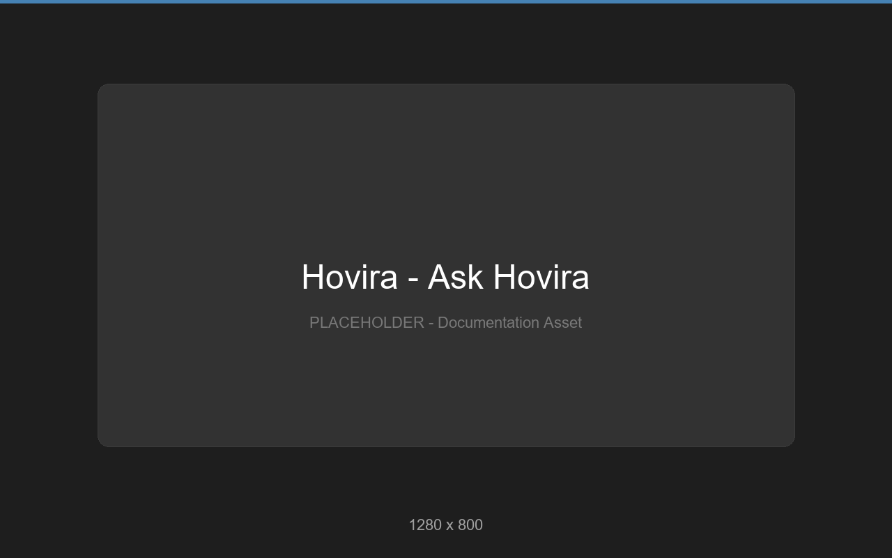
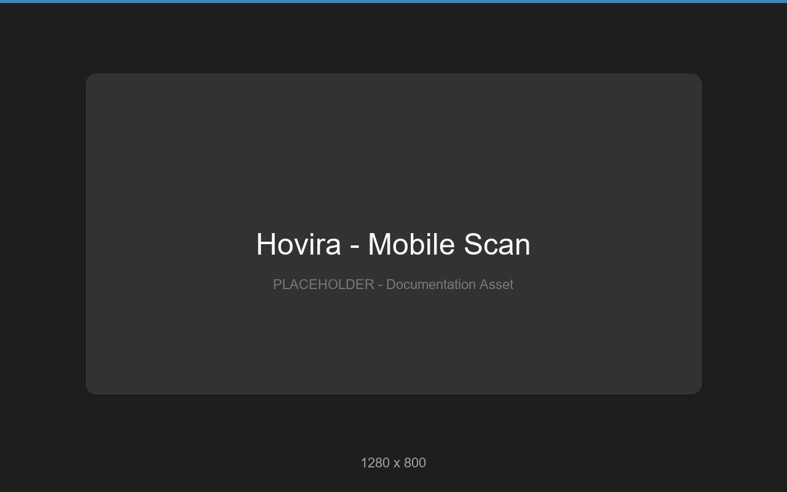

<div align="center">



# **Hovira**

### Your private AI household intelligence system.

**Hovira is not just a product passport. It is a private AI household intelligence system that remembers, understands and helps you manage everything that matters at home.**

[](https://hovira.netlify.app/)
[](PROJECT_DOCUMENTATION.md)
[](LICENSE)

</div>

---

## ✨ The Big Idea in One Line

Turn the clutter of home ownership — receipts, warranties, manuals, appliances — into a **living, searchable household memory** powered by private, on-device AI. Scan it once. Ask about it forever.

---

## ⚡ Impact at a Glance

<div align="center">

| **98.1%** | **<100 ms** | **5 classes** | **3 services** |
|:---:|:---:|:---:|:---:|
| Custom YOLO mAP@50 | On-device detection | Household appliances | Full-stack monorepo |

</div>

---

## 🧩 The Problem

Household ownership is broken. Receipts rot in drawers. Warranty cards expire unclaimed. Manuals vanish the moment you need them. Every family juggles dozens of products with **zero digital structure** — losing money on missed warranties and wasting hours hunting for information that should be instant.

---

## 💡 The Solution

Hovira turns your phone into a **household intelligence hub**:

- 📸 Upload a photo of any receipt, invoice, or warranty card → AI extracts date, price, serial number, warranty window.
- 🎯 Point your camera at any appliance → a fine-tuned computer vision model identifies it in **under 100 ms**.
- 🧠 Everything links into a unified **Household Product Graph** you can search, query, and act on — creating a **Digital Product Passport** for every item you own.

---

## 💬 Why This Matters

Hovira begins as a **Digital Product Passport** platform — the kind the EU is mandating for consumer electronics — but its true trajectory is **Private AI Household Intelligence**. Every receipt scanned, every appliance photographed, every warranty tracked adds a node to a household graph that **no cloud service has access to**. Your data stays yours. Your intelligence compounds.

Over time, Hovira evolves from a document tool into a **household operating system** that knows what you own, when it needs attention, and what it's worth.

> Private. Local. Compounding. **That** is what makes Hovira different.

---

## 🆚 Why Hovira is Different

| Traditional Approach | Hovira |
|---|---|
| Store files in folders and forget them | AI extracts & structures data automatically |
| Manual data entry | OCR + Vision AI does the work |
| Generic cloud storage | Household-specific product graph |
| No physical product link | Camera identifies appliances & links to documents |
| Reactive — warranty expired before you knew | Proactive alerts & maintenance scheduling |
| SaaS upsell of your data | **Private-by-design, data stays on your devices** |

---

## 🏗️ Core AI Architecture

<div align="center">

</div>

A **three-service monorepo** orchestrated end-to-end:

| Layer | Stack | Role |
|---|---|---|
| 🐍 **Python AI Microservice** | FastAPI · port 8000 | YOLO detection, OCR extraction, document understanding |
| ⚡ **Node.js API Gateway** | Express 5 · port 5000 | Routing, validation, passport management |
| ⚛️ **React Frontend** | Vite · port 5173 | Dashboard, scanner, passport viewer |

---

## ⭐ Key Features

- 🧾 **Dual-Evidence Intake** — Upload commercial documents *and* physical product photos for verified ownership.
- 👁️ **Custom YOLO Detector** — Fine-tuned on 5 household appliance classes at **98.1% mAP@50**, <100 ms latency.
- 🛡️ **Zero-Fabrication Extraction** — Anti-hallucination OCR with strict provenance tracking. If it can't be verified, it says so.
- 🔐 **Cryptographic DPP Certificates** — SHA-256 sealed Digital Product Passports with EU Ecodesign compliance markers.
- 📱 **Phone-First QR Bridge** — Instant mobile camera access with zero app installation.
- 🚀 **1-Click Demo Presets** — Pre-loaded judge scenarios for instant evaluation.

---

## 🔄 How It Works

<div align="center">

</div>

**Product / Document / Room / Event → Household Memory → Local AI + Vision → Hovira AI → Insight / Action**

```
Scan → Identify → Create Passport → Attach Documents
     → Build Household Memory → Ask Hovira → Get grounded insight
```

**From photo to verified passport in 4 steps:**

1. **Upload** — Snap a photo of a receipt/invoice and a photo of the physical appliance.
2. **Extract** — AI pulls date, price, serial number, warranty terms via OCR + document understanding.
3. **Detect** — Custom YOLO identifies the appliance class, draws verified bounding boxes, computes confidence.
4. **Mint** — A cryptographic DPP certificate links commercial evidence to physical proof.

---

## 🗺️ The AI Stack

| Technology | Role |
|---|---|
| 🎯 **Custom YOLO appliance detection** | Fine-tuned 98.1% mAP@50 household detector |
| 🧠 **Qwen Vision / Qwen-VL** | Local vision-language understanding via Ollama |
| 🔤 **OCR** | RapidOCR (ONNX) + Tesseract for invoices, receipts, labels |
| 🔗 **Semantic matching** | Alias-aware product linkage (washer ↔ washing machine) |
| 🕸️ **Household memory / knowledge graph** | Living graph of people, rooms, items & history |
| 📄 **Digital Product Passport** | Verifiable, private identity record per product |
| 🔔 **Warranty & document intelligence** | Coverage, claims & expiry extracted from paperwork |
| 🔒 **Local / private AI direction** | Data stays on-device — no cloud scanning or sharing |

---

## 🔮 Future Vision

> The following are **planned** capabilities — **not yet implemented**. They represent Hovira's evolution into a full Household Intelligence OS.

| Capability | Description |
|---|---|
| 📍 **Spatial Memory** | Map products & documents to rooms and physical locations |
| 📷 **Point-and-Ask Camera** | Real-time AR HUD showing warranty status when you point at any appliance |
| 🌦️ **Context & Season-Aware Intelligence** | Proactive advice adapting to weather, seasons & usage |
| ⚠️ **Attention Center** | Priority-ranked dashboard: critical alerts, maintenance, consumables |
| 🔧 **Maintenance Intelligence** | Lifecycle engine tracking installs, service, wear & expiration |
| 📘 **AI Manual Assistant** | RAG Q&A over manuals — *"How do I clean the drain filter?"* |
| 🕰️ **Household Timeline** | Chronological view of every purchase, service & warranty event |
| 📴 **Local / Offline Intelligence** | Full on-device pipeline via edge NPU — zero cloud dependency |

---

## ⌨️ Getting Started

### Prerequisites
- **Node.js** v18+ (v24 recommended)
- **pnpm** v9+ (v11 recommended)
- **Python** 3.10+ with pip

### Install
```bash
pnpm install                      # monorepo frontend + API
pip install -r apps/ai-service/requirements.txt   # Python AI service
```

### Run everything (one command)
```bash
pnpm dev:all
# Starts AI service (:8000) + API gateway (:5000) + web UI (:5173)
```
> On Windows, simply double-click `run.bat`.

### Run individually
```bash
pnpm dev:ai     # Python AI Microservice
pnpm dev:api    # Node.js API Gateway
pnpm dev:web    # React Frontend
```

### Build & test
```bash
pnpm build                 # production build
pnpm test:ai               # Python AI pipeline (YOLO + OCR + Extractor)
pnpm test:suite            # REST API integration tests
pnpm typecheck             # TypeScript type checking
```

---

## ✂️ Project Structure

```
hovira/
├── apps/
│   ├── web/                 # React 19 + Tailwind CSS frontend
│   ├── api/                 # Express 5 API gateway
│   └── ai-service/          # Python FastAPI AI microservice
│       ├── app/
│       │   ├── main.py      # FastAPI routes
│       │   ├── detector.py  # YOLO dual-engine detection
│       │   ├── extractor.py # Document understanding
│       │   └── ocr.py       # RapidOCR + Tesseract
│       └── models/          # Custom + COCO YOLO weights
├── packages/
│   ├── api-spec/            # OpenAPI 3.1 schema
│   ├── api-zod/             # Zod validation schemas
│   └── api-client-react/    # React Query hooks
├── Model/                   # YOLO training pipeline & dataset
├── samples/                 # Test invoices, receipts, appliance photos
└── docs/
    ├── images/              # Hero, architecture, how-it-works visuals
    └── diagrams/            # System stack & flow diagrams
```

---

## 🛠️ Technology Stack

| Layer | Technologies |
|---|---|
| **Frontend** | React 19, Tailwind CSS v4, Vite 7, TanStack Query v5, Wouter, Framer Motion, Lucide Icons |
| **API Gateway** | Node.js, Express 5, Pino Logger, CORS |
| **AI / ML** | Ultralytics YOLO, RapidOCR (ONNX), PyTorch, OpenCV, FastAPI, Uvicorn |
| **Vision Fallback** | Ollama (Qwen2.5-VL) for deep document understanding |
| **API Spec** | OpenAPI 3.1, Zod validation, Orval code generation |
| **Monorepo** | pnpm workspaces, esbuild, concurrently |
| **Deployment** | Netlify (frontend), local development (API + AI) |

---

## 📷 Screenshots

| Dashboard | Create Passport | Scanner |
|:---------:|:---------------:|:-------:|
|  |  |  |

| Ask Hovira | Product Scan | AI Insight | Mobile Scan |
|:----------:|:------------:|:----------:|:-----------:|
|  |  |  |  |

> Screenshots are from the current demo. Replace with actual UI captures as the product evolves.

---

## 📎 Links

- 🟢 **Live Demo:** [hovira.netlify.app](https://hovira.netlify.app/)
- 📦 **Repository:** [github.com/ATS-AI-6278/IQ-Hackathon](https://github.com/ATS-AI-6278/IQ-Hackathon)
- 📄 **Technical Documentation:** [PROJECT_DOCUMENTATION.md](PROJECT_DOCUMENTATION.md)
- 🎞️ **Presentation Deck:** [Smart_Product_Passport_Project_Presentation.pptx](Smart_Product_Passport_Project_Presentation.pptx)

---

<div align="center">

**Hovira** — From scattered papers to household intelligence.

**Not just a product passport. A private AI household intelligence system that remembers, understands and helps you manage everything that matters at home.**

Licensed under [Apache 2.0](LICENSE)

</div>
